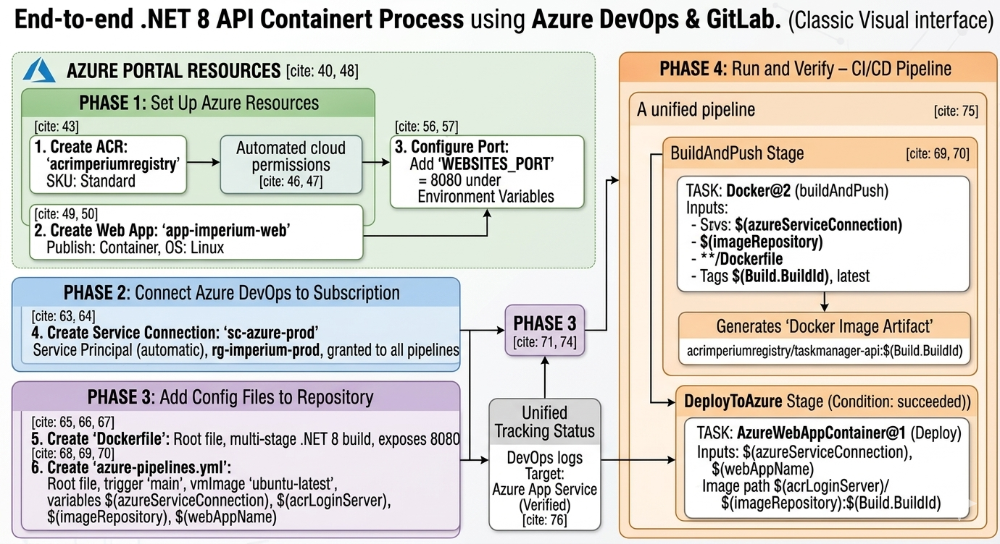
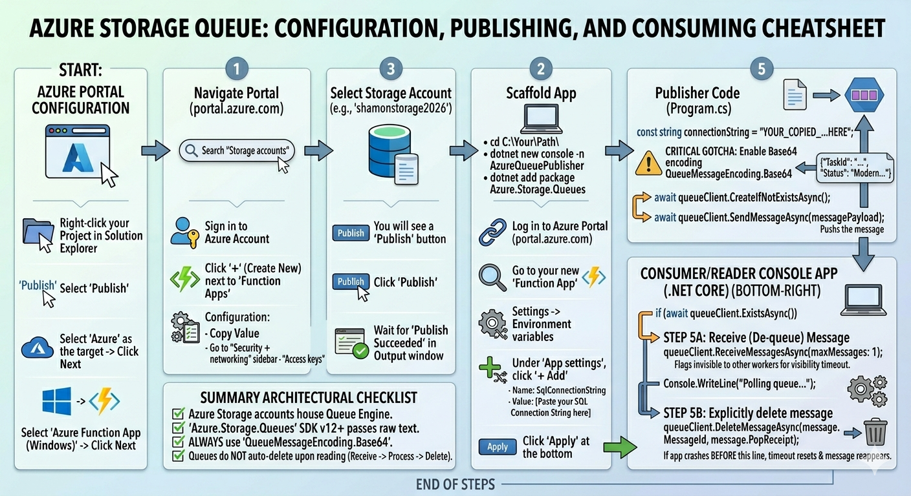
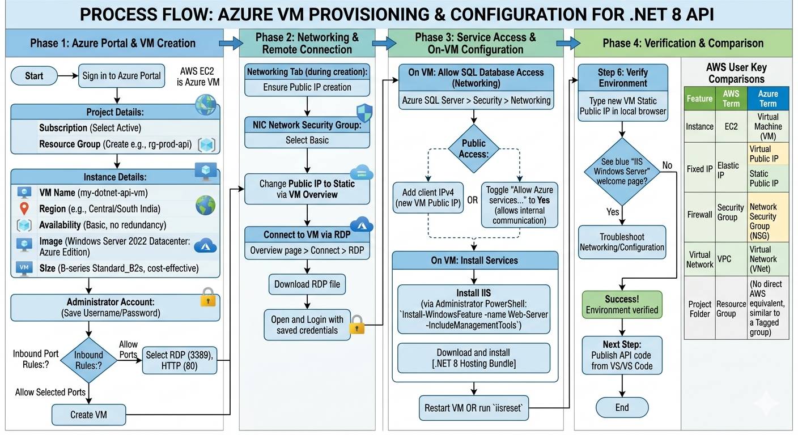

# AZURE-CLUOD-SERVICES
This repository provides a collection of architectural blueprints and step-by-step process flows for Azure cloud services. It demonstrates advanced implementation patterns for serverless compute, event-driven messaging, relational databases, and automated CI/CD pipelines.

---

## 🏗️ Architectural Workflows

### 1. Azure Function Deployment Workflow
This visual guide, outlines the end-to-end process for publishing a .NET-based Azure Function (Isolated Worker model) from Visual Studio to the cloud. It covers the essential configuration steps, including resource creation, handling environment variables in the Azure Portal, and configuring SQL firewall permissions to ensure secure connectivity.

**Process Flow:**

---

### 2. .NET API CI/CD Pipeline
This architecture diagram, illustrates a streamlined CI/CD pipeline for a .NET 8 API, integrating GitLab as the source repository with Azure DevOps for automated deployment. The workflow details the end-to-end process, including connecting GitLab via tokens, utilizing Azure DevOps Classic Pipelines for build automation, and executing releases to an Azure VM target through dedicated Deployment Groups and IIS Web App deployment.

**Process Flow:**

---

### 3. .NET API Containerized CI/CD Pipeline
TThis architecture diagram, demonstrates the end-to-end containerization and deployment process for a .NET API. The workflow details the configuration of Azure Portal resources, including Azure Container Registry (ACR) and Linux-based Web Apps. It further outlines the integration of Azure DevOps with unified pipelines to automate the build, push, and deployment stages, utilizing Docker-based tasks to manage image artifacts and environment variables.

**Process Flow:**

---

### 4. Azure Storage Queue Implementation Guide
This reference, provides a comprehensive cheat sheet for configuring, publishing, and consuming messages within Azure Storage Queues. The guide details the necessary Azure Portal setup and highlights critical implementation patterns for .NET developers, such as enabling Base64 encoding for queue messages, using the Azure.Storage.Queues SDK, and implementing the essential receive-process-delete lifecycle to ensure robust message handling.

**Process Flow:**

---

### 5. Azure VM Provisioning & IIS Configuration
This process flow, details the end-to-end setup of an Azure Virtual Machine to host a .NET 8 API. It outlines the full lifecycle, from initial resource provisioning and networking configuration to installing IIS and the .NET 8 Hosting Bundle. Additionally, the guide includes a comparative breakdown mapping common AWS terminology to their Azure equivalents, providing a helpful reference for developers transitioning between these cloud environments.

**Process Flow:**

---
