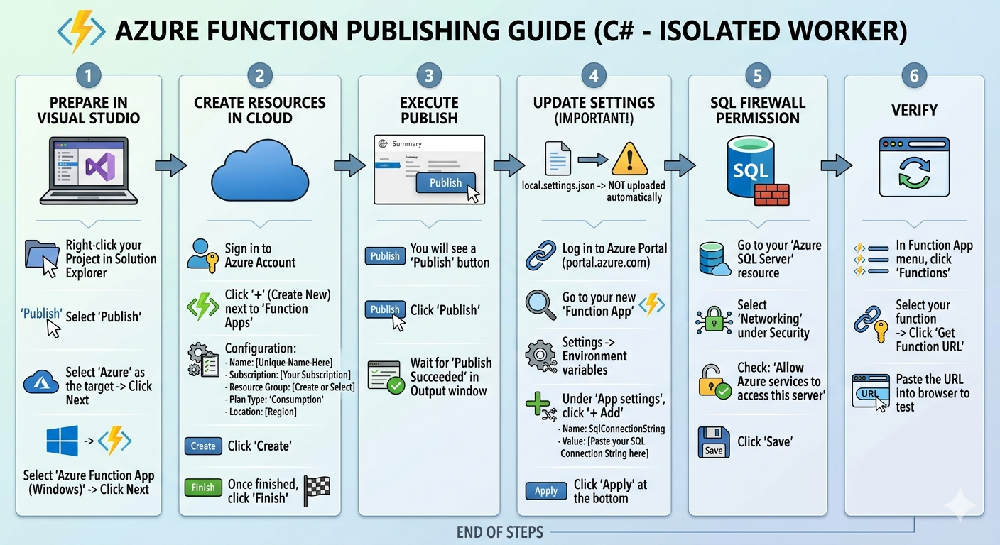
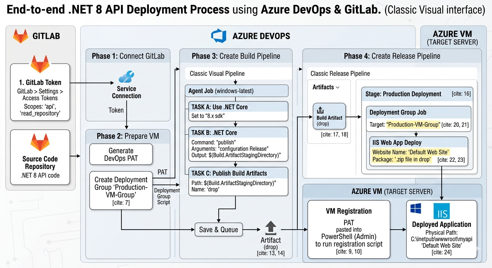

# AZURE-CLUOD-SERVICESAWS
This repository provides a collection of architectural blueprints and step-by-step process flows for Azure cloud services. It demonstrates advanced implementation patterns for serverless compute, event-driven messaging, relational databases, and automated CI/CD pipelines.

---

## 🏗️ Architectural Workflows

### 1. Azure Function Deployment Workflow
This visual guide, outlines the end-to-end process for publishing a .NET-based Azure Function (Isolated Worker model) from Visual Studio to the cloud. It covers the essential configuration steps, including resource creation, handling environment variables in the Azure Portal, and configuring SQL firewall permissions to ensure secure connectivity.

**Process Flow:**

---

### 1. .NET API CI/CD Pipeline
This architecture diagram, illustrates a streamlined CI/CD pipeline for a .NET 8 API, integrating GitLab as the source repository with Azure DevOps for automated deployment. The workflow details the end-to-end process, including connecting GitLab via tokens, utilizing Azure DevOps Classic Pipelines for build automation, and executing releases to an Azure VM target through dedicated Deployment Groups and IIS Web App deployment.

**Process Flow:**

---